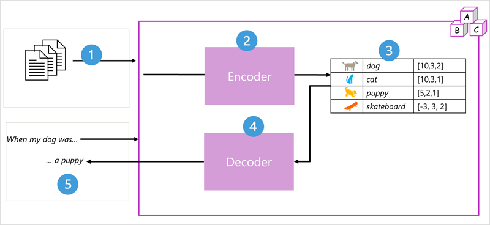

## Introduction

Generative AI, and technologies that implement it like Microsoft Copilot are increasingly in the public consciousness – even among people who don't work in technology roles or have a background in computer science or machine learning. The futurist and novelist Arthur C. Clarke is quoted as observing that "any sufficiently advanced technology is indistinguishable from magic". In the case of generative AI, it does seem to have an almost miraculous ability to produce human-like original content, including poetry, prose, and even computer code.

However, there’s no wizardry involved in generative AI – just the application of mathematical techniques incrementally discovered and refined over many years of research into statistics, data science, and machine learning. You can gain a high-level understanding of how the magic trick is done by learning the core concepts and principles explored in this module. As you learn more about the generative AI technologies we have today, you can help society imagine new possibilities for AI tomorrow.

### What is generative AI?

Artificial Intelligence (AI) imitates human behavior by using machine learning to interact with the environment and execute tasks without explicit directions on what to output.

Generative AI describes a category of capabilities within AI that create original content. People typically interact with generative AI that has been built into chat applications. One popular example of such an application is Microsoft Copilot, an AI-powered productivity tool designed to enhance your work experience by providing real-time intelligence and assistance.

Generative AI applications take in natural language input, and return appropriate responses in a variety of formats such as natural language, images, code, and more.

Natural language generation
To generate a natural language response, you might submit a request such as "Write a cover letter for a person with a bachelor's degree in history."

A generative AI application might respond to such a request like this:

Dear Hiring Manager, I am writing to express my interest in the position of...

### Image generation

Some generative AI applications can interpret a natural language request and generate an appropriate image. For example, you might submit a request like "Create a logo for a florist business."

A generative AI application could then return an original new image based on the description you provided,

Code generation
Some generative AI applications are designed to help software developers write code. For example, you could submit a request like "Write Python code to add two numbers." and generate the following response:

```
def add_numbers(a, b):
    return a + b
```

###

What are language models?

Generative AI applications are powered by language models, which are a specialized type of machine learning model that you can use to perform natural language processing (NLP) tasks, including:

Determining sentiment or otherwise classifying natural language text.
Summarizing text.
Comparing multiple text sources for semantic similarity.
Generating new natural language.
While the mathematical principles behind these language models can be complex, a basic understanding of the architecture used to implement them can help you gain a conceptual understanding of how they work.

Transformer models
Machine learning models for natural language processing have evolved over many years. Today's cutting-edge large language models are based on the transformer architecture, which builds on and extends some techniques that have been proven successful in modeling vocabularies to support NLP tasks - and in particular in generating language. Transformer models are trained with large volumes of text, enabling them to represent the semantic relationships between words and use those relationships to determine probable sequences of text that make sense. Transformer models with a large enough vocabulary are capable of generating language responses that are tough to distinguish from human responses.

Transformer model architecture consists of two components, or blocks:

An encoder block that creates semantic representations of the training vocabulary.
A decoder block that generates new language sequences.



The model is trained with a large volume of natural language text, often sourced from the internet or other public sources of text.
The sequences of text are broken down into tokens (for example, individual words) and the encoder block processes these token sequences using a technique called attention to determine relationships between tokens (for example, which tokens influence the presence of other tokens in a sequence, different tokens that are commonly used in the same context, and so on.)
The output from the encoder is a collection of vectors (multi-valued numeric arrays) in which each element of the vector represents a semantic attribute of the tokens. These vectors are referred to as embeddings.
The decoder block works on a new sequence of text tokens and uses the embeddings generated by the encoder to generate an appropriate natural language output.
For example, given an input sequence like "When my dog was", the model can use the attention technique to analyze the input tokens and the semantic attributes encoded in the embeddings to predict an appropriate completion of the sentence, such as "a puppy".
In practice, the specific implementations of the architecture vary – for example, the Bidirectional Encoder Representations from Transformers (BERT) model developed by Google to support their search engine uses only the encoder block, while the Generative Pretrained Transformer (GPT) model developed by OpenAI uses only the decoder block.

While a complete explanation of every aspect of transformer models is beyond the scope of this module, an explanation of some of the key elements in a transformer can help you get a sense for how they support generative AI.

### Tokenization

The first step in training a transformer model is to decompose the training text into tokens - in other words, identify each unique text value. For the sake of simplicity, you can think of each distinct word in the training text as a token (though in reality, tokens can be generated for partial words, or combinations of words and punctuation).

For example, consider the following sentence:

I heard a dog bark loudly at a cat

To tokenize this text, you can identify each discrete word and assign token IDs to them. For example:

```
- I (1)
- heard (2)
- a (3)
- dog (4)
- bark (5)
- loudly (6)
- at (7)
- ("a" is already tokenized as 3)
- cat (8)
```

The sentence can now be represented with the tokens: {1 2 3 4 5 6 7 3 8}. Similarly, the sentence "I heard a cat" could be represented as {1 2 3 8}.

As you continue to train the model, each new token in the training text is added to the vocabulary with appropriate token IDs:

```
- meow (9)
- skateboard (10)
- *and so on...*
```

With a sufficiently large set of training text, a vocabulary of many thousands of tokens could be compiled.
