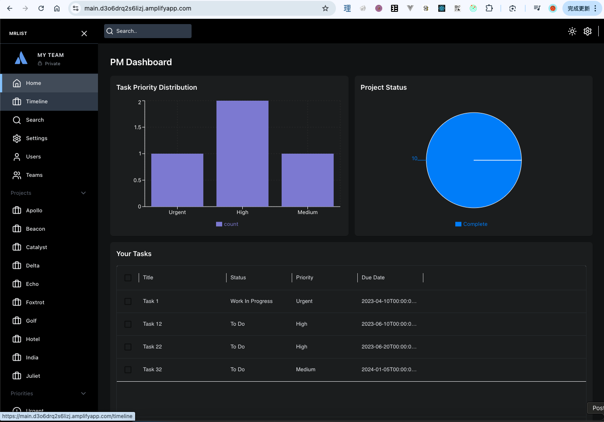
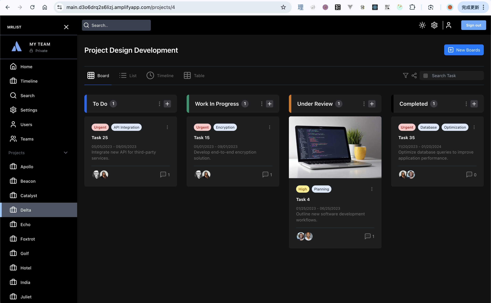
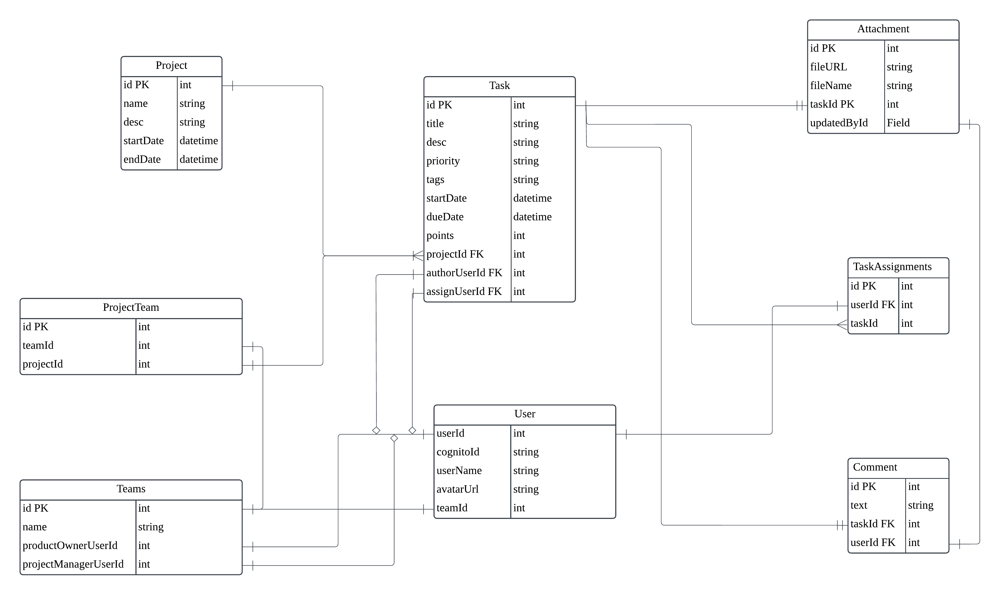

[github repo](https://github.com/lengdaxia/project-management)

## Intro

## ScreenShots

**Home**



## Entity Relation Picture



## Aws cloud achitecture


---

### aws setup

- VPC,Internet Gateway, RouteTable, SecurityGroup, ect..
- EC2 commands

#### Connect to aws ec2 using connect web console

```
# become root user
sudo su -

# install nvm to manage node
curl -o- https://raw.githubusercontent.com/nvm-sh/nvm/v0.39.7/install.sh | bash

# active the nvm
source ~/.bashrc

# nvm install node lts
nvm install --lts

# check if package installed correcttly
node -v
npm -v
nvm -v
```

#### update amazon linux packages and nessiary tools

```
sudo yum update -y
sudo yum install git -y
git --version
```

clone src code

```
git clone [clien code]
cd /[clien dir] && npm i

git clone [server code]
cd [servce path] && npm i
```

install PM2 to restart node servce when linux reboot

```
npm install pm2 -g

```

**Set pm2 to restart automatically on system reboot:**

```
sudo env PATH=$PATH:$(which node) $(which pm2) startup systemd -u $USER --hp $(eval echo ~$USER)
```

**Start the application using the pm2 ecosystem configuration:**

```
pm2 start ecosystem.config.js
```

- useful pm2 commands

```
pm2 stop all
pm2 delete all
pm2 status
pm2 monit
```

---

### AWS RDS setup

#### 1. Init instance

```
DATABASE_URL="postgresql://[db_username]:[pwd]@[rds-endpoint or ip]:[port]/[db_name]?schema=public"
```

#### 2. init database

```
# 1. create prisma client
npx prisma generate

# 2. make first db migrate to create model-schema
npx prisma migrate dev --name init

# 3. load seed data
npm run seed
```

#### 3. S3 image storage

```
# bucket policy
{
    "Version": "2012-10-17",
    "Statement": [
        {
            "Sid": "PublicReadGetObject",
            "Effect": "Allow",
            "Principal": "*",
            "Action": "s3:GetObject",
            "Resource": "arn:aws:s3:::jira-pm-s3-images/*"
        }
    ]
}
```

#### 4. Lambda

```
# handler code

import https from "node:https";

export const handler = async (event) => {
  const postUserData = JSON.stringify({
    username: event.request.userAttributes['preffered_username'] || event.userName,
    cognitoId: event.userName,
    profilePictureUrl: "i1.jpg",
    teamId: 1
  });

  const options = {
    hostname: "siop1qyu1m.execute-api.ap-northeast-1.amazonaws.com",
    port: 443,
    path: "/create-user",
    method: "POST",
    headers: {
      "Content-Type": "application/json",
      "Content-Length": Buffer.byteLength(postUserData)
    }
  }
  const responseBody = await new Promise((resolve, reject) => {
    const req = https.request(options, (res) => {
      res.setEncoding("utf8");
      let body = "";
      res.on("data", chunk => body += chunk);
      res.on("end", () => resolve(body));
    });

    req.on("error", reject);
    req.write(postUserData);
    req.end();
  });

  return event;
};

```

#### 5. API gate-way

#### 6. Amplify
